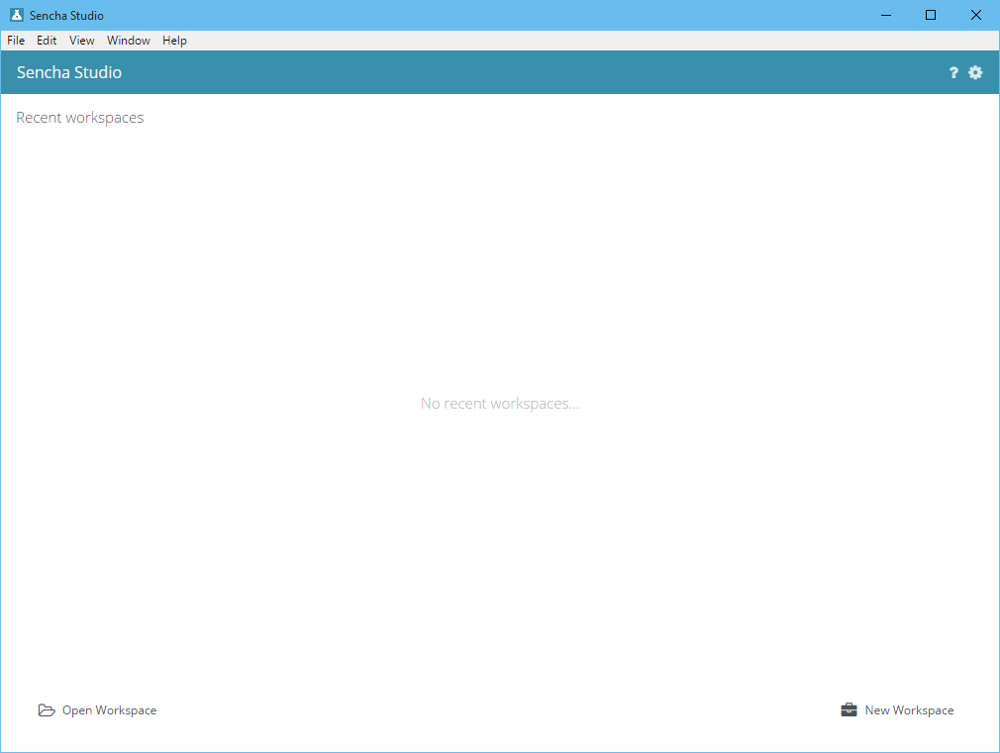
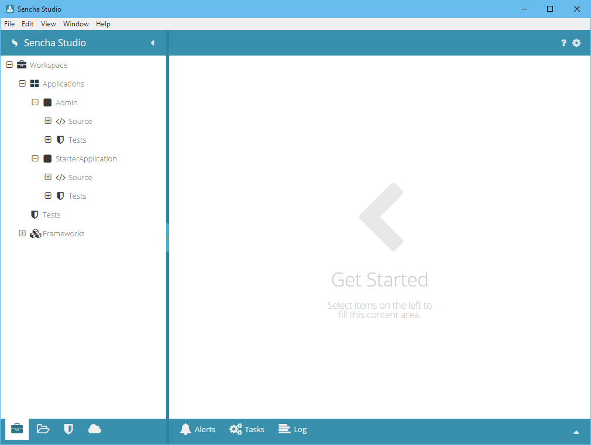
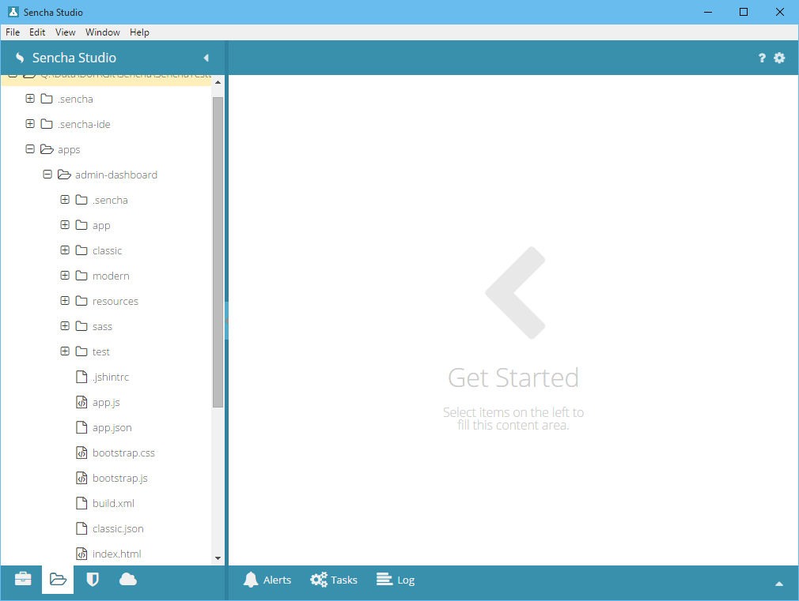
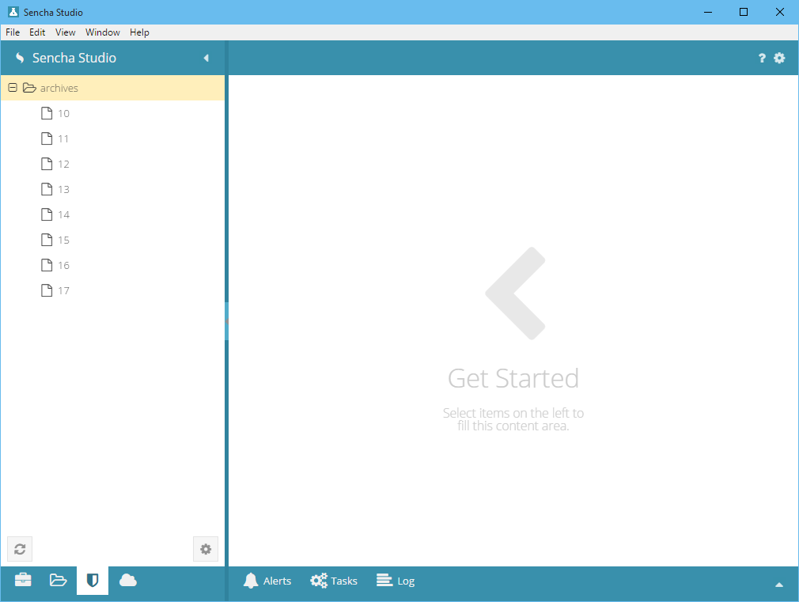
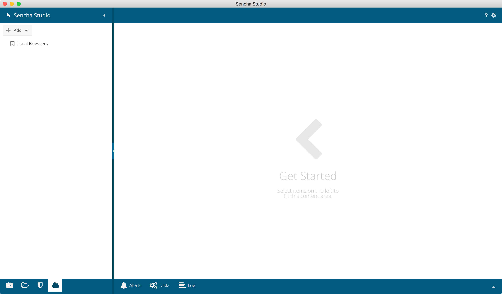
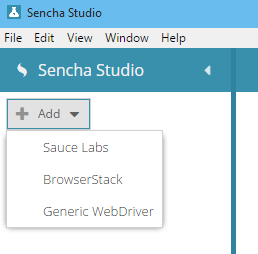
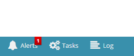

# Getting Started

Once you have [installed Sencha Test](sencha_test_installation.html), the next step is organizing your
test environment. As a developer or test engineer, Sencha Studio is where most of the action takes place. Once
you have created and configured your test environment in Sencha Studio, you can use the **stc**
command-line tool to automate test execution. This guide will introduce the core concepts for organizing
your test projects and show you how to quickly get going with Sencha Studio.

## Sencha Studio

When launched, Sencha Studio will present you with the welcome screen.  This is where you 
select your role.

A workspace is a top-level container for all the things that define the test environment. A workspace is simply a
directory in the file system that contains a `"workspace.json"` file. This file is understood by both Sencha Test
as well as Sencha Cmd (6+). This file describes things like applications, packages, themes, Sencha frameworks, and
now **Test Projects**.

You will first need to open an existing workspace or create a new workspace. If you are using Sencha Cmd, you can
simply open your existing Sencha Cmd workspace or stand-alone application directly in Sencha Test. Sencha Cmd is
not required, so don't worry if you are not currently using it. If Sencha Cmd is installed, however, Sencha Studio
will enable its Cmd Integration feature by default. This can be disabled using the Preferences dialog. Be aware that
disabling this integration does not change the fact that both Sencha Test and Sencha Cmd will share the same
`"workspace.json"` file.

At present, each application, package, and workspace may contain a single test project (backed by a "test/project.json" 
file by default).  Test projects house the test suites discussed in further detail in later guides.

### Creating Workspaces
You can create a new workspace using the “New Workspace” button on the bottom-right side of the welcome screen.

1. Click the “New Workspace” button
1. Choose the destination folder for the project
1. Click "OK"

Once you have created (or opened) a workspace, Sencha Studio will display it on the welcome screen when you next
launch the application.

### Opening a Workspace
If you have existing workspace, for example if you pull the code from a source control repository, you would
click on the “Open Workspace” button and selecting the existing workspace folder.  

Sencha Studio seamlessly integrates with workspaces generated by Sencha Cmd, which may house applications, themes, or 
packages. Simply click “Open Workspace” to open these workspaces.

### Workspace Screen
Once you open a workspace, Sencha Studio will display its content in its project navigation tree on the left side
of the application. To illustrate, we will open the "Workspace" folder of the
[demo project on GitHub](https://github.com/sencha/SenchaTestDemo) and expand the two application nodes.

Because this project is a Sencha Cmd workspace, there can be applications (in this case, two of them) in addition to
test projects. Each application has its own test project indicated by the expandable **Tests** node:

The workspace itself can also contain a test project, but it is not initialized in this case which can be seen
as an unexpandable **Tests** node.

To create or configure test projects, see the [Projects, Scenarios and Suites](test_projects_scenarios_suites.html)
guide.

### Viewing Files
The project tree displays the workspace contents in a logical structure. You can also view the actual files
and folders in the workspace by switching to the **Files** tab.

Selecting a text file in the tree will open the file in Sencha Studio's text editor. Selecting unrecognized file
types has no effect.

### Reviewing Test Runs
To review results from test runs associated with the workspace, select the **Runs** tab.

The test runs listed in this tab are retrievevd from the associated Sencha Test Archive Server. Selecting a
run will download the results and display them in the content area.

### Configuring Browser Farms
To manage browser farms (access information for WebDriver hubs), select the **Browsers** tab.

From this tab, you can add new browser farm definitions. These defintions can be used in Sencha Studio's Test
Runner or from the command-line using **stc**.

### Switching Workspaces
To return to the welcome screen after opening a workspace, select the following from the application menu:

    File / Sencha Studio        (Windows and Linux / Mac)
        Close Workspace

You may also select from recently opened workspaces using the application menu:

    File / Sencha Studio
        Reopen Workspace
            [recently opened workspaces]

You can open a workspace from any view using the application menu:

    File / Sencha Studio
        Open Workspace

You may also create a new workspace using the application menu:

    File / Sencha Studio
        New
            Workspace...

If you have Sencha Cmd installed and enabled within Sencha Studio, you may also add an application, package, or theme 
from the "New" menu.

    File / Sencha Studio
        New
            Application...
            Package...
            Theme...

### Preferences and Help
Sencha Studio has many configuration preferences. These can be accessed using the "gear" icon in the upper-right
of the application.

To get help, click the "?" icon and the Sencha Test Documentation page will be opened in the default browser.

### Additional Items
In addition to the main functional pieces of Sencha Studio, there are three tabs that provide access to some of
the more internal aspects of Sencha Studio.

The **Alerts** tab contains important messages and items that may require your attention. Alerts are different
from log messages in that they are typically requests for action or important notifications. These messages can
be discarded when you no longer need to them. The **Tasks** tab shows a list of active background activities
managed by Sencha Studio.

The **Log** tab will display and filter log messages from various sources (like background tasks). The log can
be easily copied to the clipboard which can help when troubleshooting problems.

## Conclusion
With your initial workspace set up, you can now proceed to creating your first test suites. Check out the 
[Projects, Scenarios, and Suites](test_projects_scenarios_suites.html) guide for instruction on setting
up the organizational structure for your tests. See the [stc usage guide](command_line_archive_server.html)
for using **stc** to run your tests from the command-line.

If you have  further questions, concerns, or bug reports, please visit the 
[Sencha Test forums](https://www.sencha.com/forum/forumdisplay.php?144-Sencha-Test).
