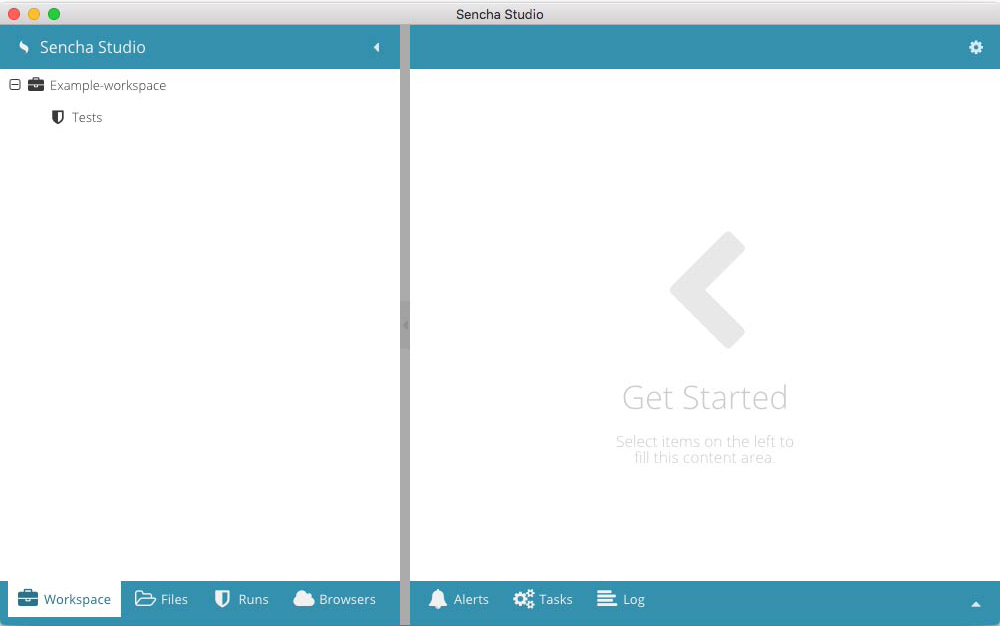
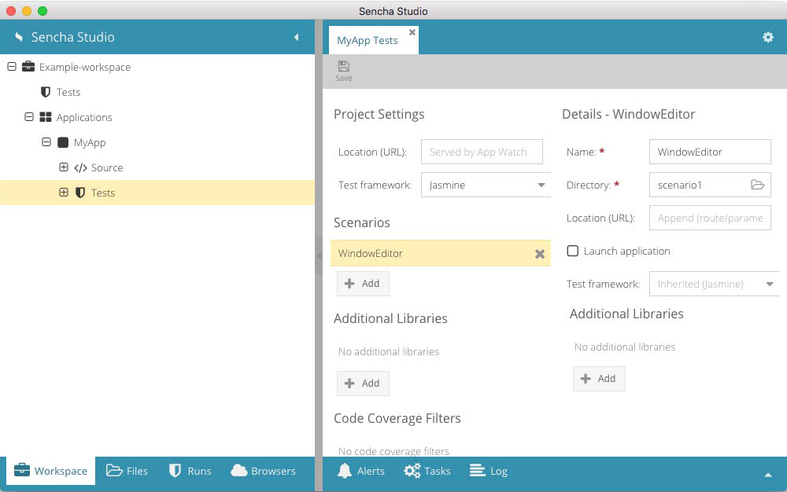
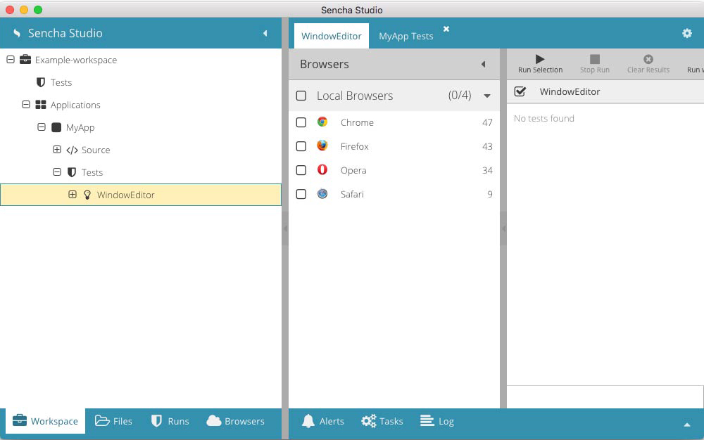
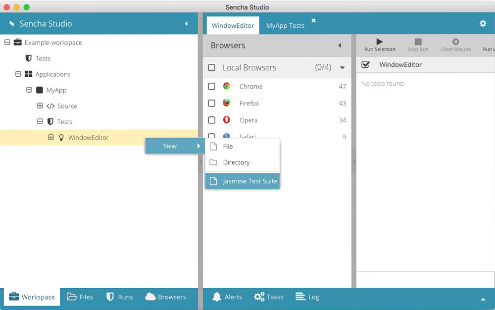
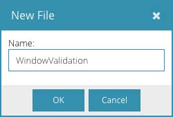
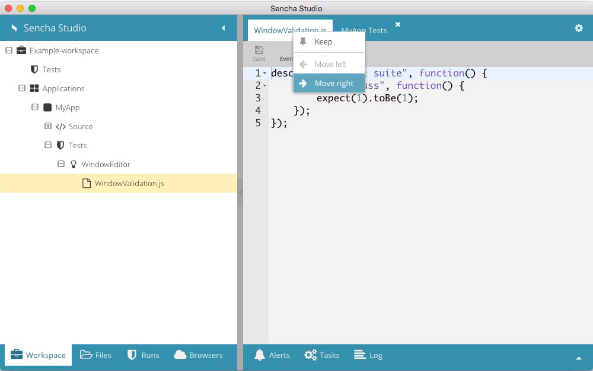
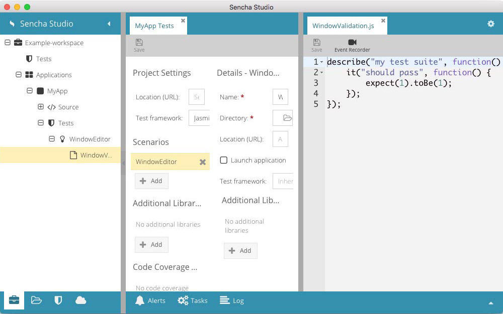
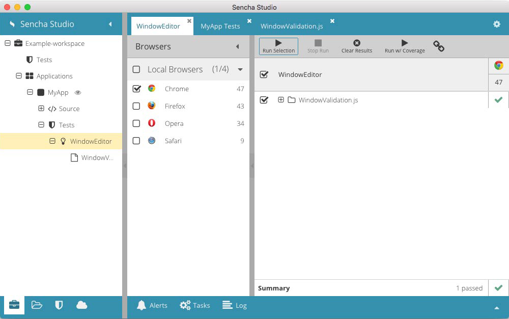
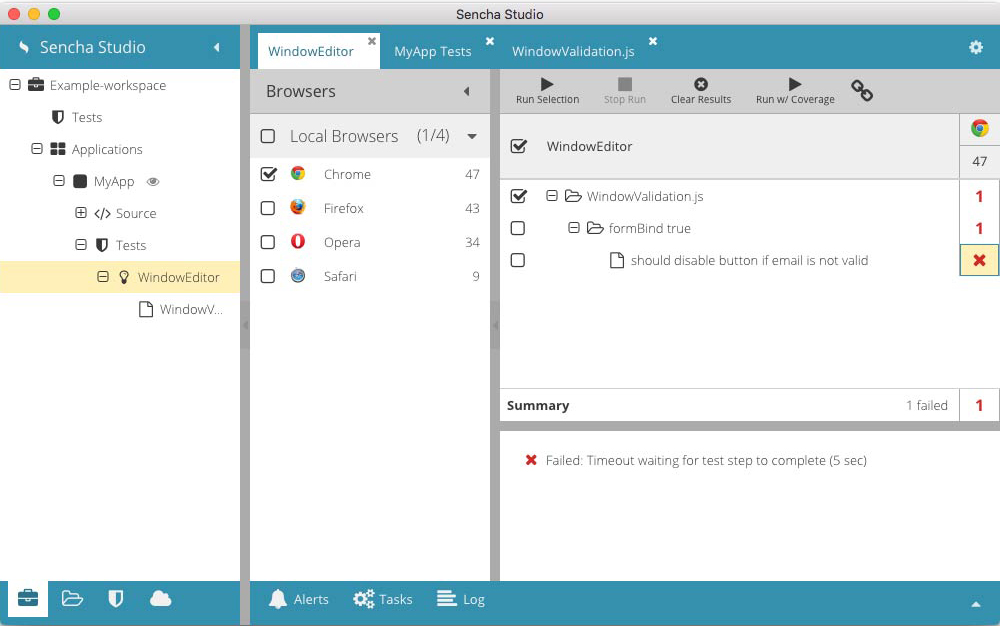

# Testing New Applications

Sencha Studio allows developers to quickly and automatically test granular aspects of an application or web page. Unit 
testing ensures that all of the pieces of your application behave as anticipated as your codebase grows and changes.

In this guide, we're going to walk through generating a new application and setting up a test environment, creating
a testable application class, and testing said class with a custom unit test. All of these things can be done directly
in Sencha Studio.

If you have an existing application, check out [Testing Existing Applications](testing_existing_apps.html).

This guide assumes some familiarity with the Jasmine test framework.  If you are unfamiliar with Jasmine or test concepts, 
check out their excellent [documentation](http://jasmine.github.io/2.0/introduction.html) for more information on 
authoring and editing Jasmine tests.  This guide also makes use of 
[Sencha Cmd](https://www.sencha.com/products/sencha-cmd/) to generate 
an [Ext JS](https://www.sencha.com/products/extjs/#overview) application and assume you 
have downloaded / installed them.

Let's get started!

##Generating a Workspace

We'll begin by opening Sencha Studio.

You can generate your required workspace with Sencha Studio by choosing the following 
from the application toolbar:
  
    Sencha Studio -> New -> Workspace...

Select the appropriate file system path and click "OK".  Your test project should 
now find itself within your newly generated workspace.

##Adding a Testable Class

The starter application has very little functionality, so let's add something that we can test.  For our purposes, let's 
create a WindowEditor class at `MyApp/app/view/main/WindowEditor.js` using the IDE of your choice.  You can use this code to 
follow along:

    Ext.define('MyApp.view.main.WindowEditor', {
       extend: 'Ext.Window',
    
       alias: 'widget.windoweditor',
    
       width:400,
       height:200,
       padding:20,
    
       autoShow: true,
    
       title: 'Update Email',
    
       items: [{
           xtype: 'form',
           items: [{
               xtype: 'textfield',
               allowBlank: false,
               vtype: 'email'
           },{
               xtype: 'button',
               text: 'Submit Change',
               formBind: true
           }]
       }]
    });

This class extends a window that contains a form, which in turn, contains a textfield and a button.  We've instructed 
the textfield that we will not allow a blank value, and that any input must pass email validation.

Additionally, we've set `formBind` true on the button.  This instructs the button to 
remain in a disabled state until the form considers itself valid.  Once valid, the button 
will change to a clickable state.

You can then replace `MyApp/app/view/main/MainController.js`'s `onItemSelected` method 
with the following:

	onItemSelected: function (sender, record) {
        Ext.create('MyApp.view.main.WindowEditor');
    }

This will open a faux email-editor for our grid.  You really don't need to modify this controller code to create the 
upcoming test in Sencha Studio.  That said, you'll find that your application's creation logic often runs parallel to the 
code you'll end up writing in your test spec.

We'll eventually use this class to test whether or not the button is successfully enabled/disabled as the text input 
satisfies our prescribed validation.

**Note:** This "editor" doesn't really do anything at this point, but it should serve our purposes for testing demonstration.  

##Initializing a Test Project

Let's get our project settings added by clicking on "Applications" child "Tests" node.  Then click 
"Initialize Test Project" in the right-hand details panel.  Upon clicking, you should see a few Project Settings.  We 
shouldn't need to change anything at this time.  However, if you do modify any of the settings, be sure to click "Save" 
before proceeding.

Next, let's add an application scenario.

##Adding a Scenario

A test project must contain a “Scenario” in order to add a suite of test specs.  

_**Scenario**_ - _Scenarios house the test suites that you will soon create._

To create a scenario, click the "+ Add" button under the Scenarios heading.  You can then change the name and file 
system location of the Scenario.  Typically, you'll want to name your Scenario based on the content you'll be testing. In 
this case, let's call it "WindowEditor".  Once added, make sure to click "Save".  We can now begin adding a suite of 
test specs to our scenario.  

##Adding a Suite

You should now see “WindowEditor” as a child of the "Tests" node.  Go ahead and click on that node, and you should see 
your local browsers and a panel that says "No tests found".  Let's change that!

Let's add a Jasmine Test Suite.  

_**Suite**_ - _A suite is a file containing a collection of tests that represent some aspect of your application.  This 
could be a class, a component, or a grouping of functions.  It really depends on how you choose to organize your 
test suites._

"Right+Click" the “Window Editor” node and then, click "New->Jasmine Test Suite".  A modal window will then pop up 
that allows you to give your Suite a name.  Let's call it "WindowValidation".

Once added, you should then see a "WindowValidation.js" file under "WindowEditor".  Click the new file and you'll see 
some stubbed in suite code to get your started.

    describe("my test suite", function() {
        it("should pass", function() {
            expect(1).toBe(1);
        });
    });

For ease of use, "Right+Click" on the `WindowValidation.js` tab and then click "Move Right".  This should split your 
screen between the WindowEditor and your Scenario's Test Runner.  This makes it much easier to make changes and test 
them quickly.

Our stubbed in suite code isn't very helpful in its current form, so let's go ahead and add a spec to our suite.

##Adding a Spec

_**Spec**_ - _A spec is an individual test in the form of a JavaScript function that explains what a portion of your 
program should accomplish.  We should explain in plain language what the test is expecting.  It should then provide 
JavaScript that performs the tests for said expectation._

It's important to note that many times your test may parallel many aspects of your application code in terms of creating 
classes and obtaining references to components.

For the time being, go ahead and paste the following suite into your `WindowEditor.js` 
file and press "Save":

    describe("formBind true", function() {
        it("should disable button if email is not valid", function(done) {
            
            // Create and reference the WindowEditor and then 
            // get reference to the button and textfield
            var win = Ext.create('MyApp.view.main.WindowEditor'),
                button = win.down('button'),      
                field  = win.down('textfield');
            
            // Set the field's value to a valid email address
            // in order to have the button fire an enable event
            field.setValue('valid@email.com');
            
            button.on('enable', function() {
                
                // Set the field's value to an invalid email address (nothing)
                // in order to have the button fire a disable event
                field.setValue('');
                
                button.on('disable', function() {
                    
                    //  Once the disable event has been called after setting a 
                    //  bad value, we can safely say that the button is properly 
                    //  hooked into the form's validity.  Thusly, we can 
                    //  alert the spec to return by calling the done function.
                    done();    
                });
            });
        });
    });

As you can see, we're testing that the button's state correctly follows the form's validity.  If the textfield contains 
a valid value, the form is valid, and the button should be enabled.  Conversely, if the textfield contains an invalid 
value, the form is invalid, and the button should be disabled.  This behavior all takes place due to the button's 
`formBind` config being set to `true`.

We are able to test that these conditions are properly met by listening to the button's enable/disable events.  If button 
fires "enable", we know that the form has become valid.  If the button fires the "disable" event, we know that the form 
has become invalid.  At that point, we can be satisfied that the test was successful and then call Jasmine's `done()` function.

In many cases, you would use an expectation to ensure the results meet your postulation.  An expectation is built with 
the expect function, which takes a value, called the actual.  It is then chained to a Matcher function which takes the 
expected value.  This determines true/false, or, in other words, pass/fail.

That said, we don't necessarily have to use an expectation in this case.  The `done()` function is passed to the `it()` method 
as an argument.  We can use `done()` by simply calling it when we determine the processing to be complete.  Generally, 
`done()` will be called as a "success" callback when dealing with asynchronous testing.  However, we can use it here 
instead of setting an expectation.  By virtue of reaching the final event, we know that we've satisfied our test, so there 
is no need for an expectation.  If the final event is never fired, `done()` will not be called, and the test will timeout 
after 5 seconds, indicating a failure.

Now that we have a test case, let's run it and ensure that our application's editor is successfully measuring our form's validity.

##Running the Test

Now that we have our test connected, let's walk through running it via a local browser.

First, select the "WindowEditor" scenario node from the Workspace navigation view to 
display the scenario's test runner tab.  Next, select your browser(s) of choice from the 
left hand Browsers pane in the test runner tab.  For our purposes, we'll select Chrome.  
Once selected, you'll see your selected browser(s) open your connected application.

**Note:** If "sencha app watch" is initializing, you'll see a yellow eye icon next to the application node.  Your 
browser will not open until the eye turns black, signifying that "app watch" has initialized.

Select "WindowValidation.js" from the WindowEditor Test Runner and click "Run Selection" 
from the top toolbar.  If all goes well, you should receive a green checkbox indicating 
that the test has successfully passed.

It may be useful to see what happens if the test fails as well, so let's force that to occur by changing our test case.  
Replace the following line:

        // Set the field's value to a valid email address
        // in order to have the button fire an enable event
        field.setValue('valid@email.com');

with this code:

        field.setValue('');

As you can imagine, this change will cause the textfield value to remain invalid, meaning the button's enable event will 
never fire and we'll never call `done()`.  After 5 seconds, the test will determine itself failed and timeout.

Save your spec and re-run the selection.  This time you should see a red "1".  This indicates that one spec failed.  If 
you expand WindowValidation.js, and then expand `formBind true`, you'll see our spec with a red "x" next to it.  If you 
click on the red "x", you can then review a summary of the error in the lower summary panel.

##Conclusion

As you may imagine, this guide only scratches the surface of what can be done with Sencha Test by way of Sencha Studio.  Hopefully, this 
introduction provides you with the knowledge you'll need to navigate through and discover the many powerful tools 
contained within Sencha Studio.

If you have further questions, concerns, or bug reports, please visit the 
[Sencha Test forums](https://www.sencha.com/forum/forumdisplay.php?144-Sencha-Test).
