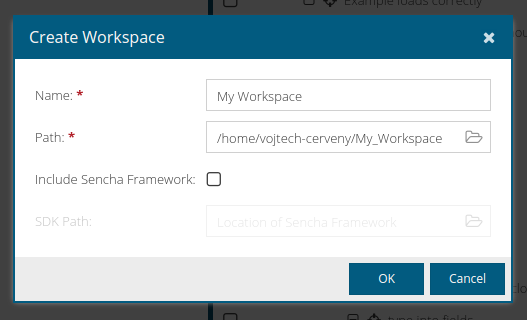
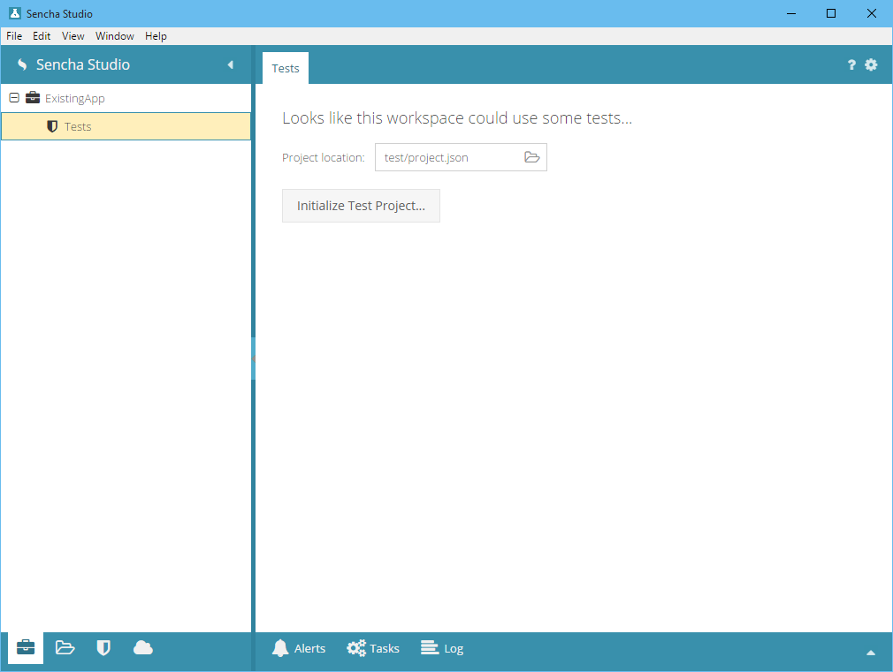
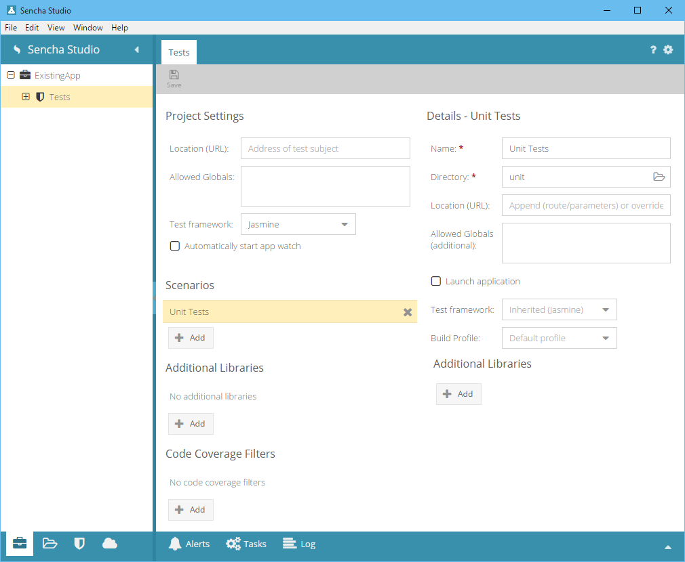
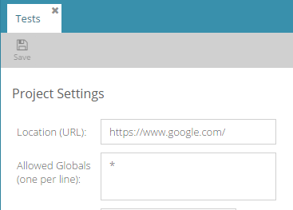
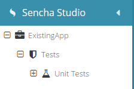
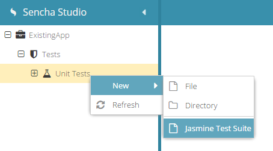
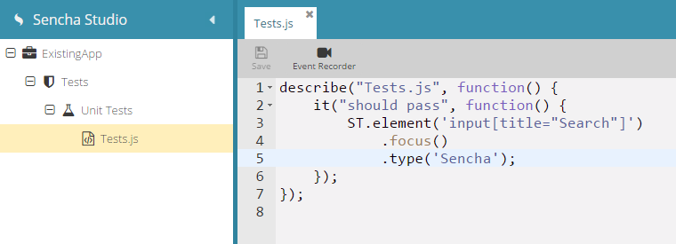
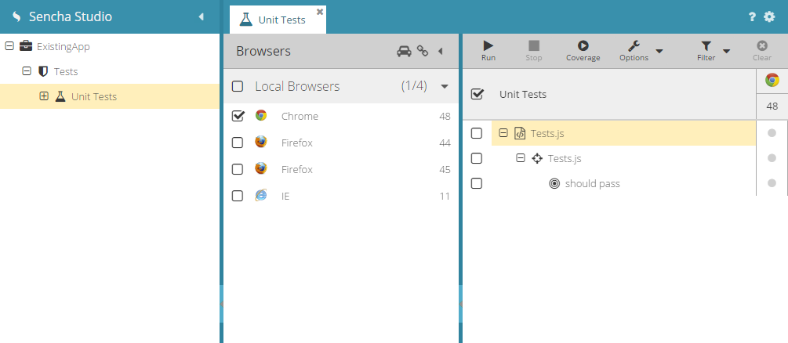
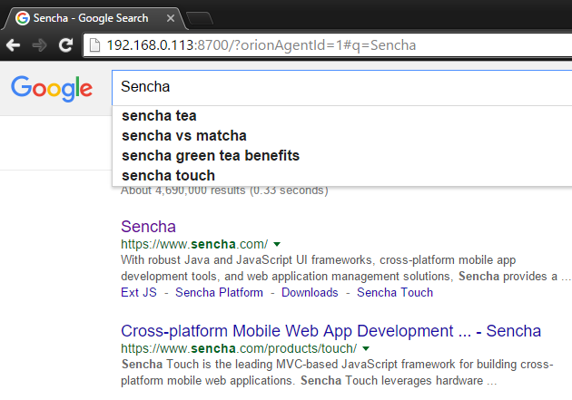

# Testing Existing Applications
Sencha Test can test your existing web applications with minimal setup required. This guide will
walk you through the process of setting up a Sencha Test Workspace to test an existing application
that is served by a remote server. Of course, because the application could just as easily be served
from a local web server, this guide will get you started testing your applications whether you are
a developer or a test engineer.

## Creating the Workspace
You can create a new workspace using the “New Workspace” button on the bottom-right side of the welcome screen.

1. Click the “New Workspace” button.
1. Choose the destination Path.
1. We can ignore the "SDK Path" since we already have an application.
1. Click "OK".

Once the workspace has been generated, Sencha Studio will open and you can configure the test project
by selecting the **Tests** node:

## Creating the Test Project
You can change the location for the test project's `"project.json"` file, but the default location (in
the `"test"` folder) is typically fine. Inside the test project you can create multiple **Test Scenarios**,
which are simply collections of tests that can be run independently.

Select the "Initialize Test Project" button to display the settings screen for the test project.

See the [Projects, Scenarios and Suites](test_projects_scenarios_suites.html) guide for more depth on the
configuration process, but for simplicity in this guide we are only going to change two things:

 - **Location** = https://www.google.com/
 - **Allowed Globals** = *

Because Google uses a lot of global variables on its page, we will disable global leak detection by
setting the "Allowed Globals" to the universal wildcard of `*`.

Click the Save button and you will see that the **Tests** node can now be expanded. The children of the Tests
node are the **Scenarios**. By default a new test project is given a "Unit Tests" scenario. This will suffice
for the sake of this guide.

### Creating the Tests
Now that we have a test project and scenario, we can create our first Jasmine tests. To do this inside
Sencha Studio, right click on the "Unit Tests" scenario node:

Enter a name when prompted, such as "Tests.js". A new node will be added to "Unit Tests" and you can
then open the file. The default Jasmine test suite is very simple so we can move right in and start doing
some more useful tests.

In the example above we are using the Sencha Test Futures API to locate and manipulate the search
field. This begins with the `ST.element()` call:

    ST.element('input[title="Search"]')
        .focus()
        .type('Sencha');

This method returns a "future element". This is an object whose methods (`focus` and `type` among others)
perform their operations on the element once it is available and visible. In other frameworks, these cases
are cumbersome to code around, but using the Futures API, this is not an issue.

To run our test, we select the **Unit Tests** node in the tree. This launches the Interactive Test Runner.
To get going, we select one of the locally detected browsers (Chrome 48 in this case), and we will see the
test tree populate with our Jasmine suite and spec.

This takes place as soon as we select the browser, because Sencha Studio will launch that browser and
load the test subject (https://www.google.com in this case) which will load all of our tests. If you look
at the URL in the address bar of the browser, however, you will see something like the following instead
of the URL we entered:

    http://192.168.0.113:8700/?orionAgentId=1

The address and port point at the local machine. To be more specific, the URL points at Sencha Studio
itself. This is because Sencha Test executes tests (in Sencha Studio and the **stc** command-line) by
acting as a middle-man or proxy between the browser and the test page or application. This allows Sencha
Test to inject Jasmine and our tests without modifying the test subject.

You can learn more about these details in [Using the Test Runner](using_the_test_runner.html).

Once we hit the Run button, we see some search results!

*Note:* Because this test manipulates the focus, some browsers will fail if they are not the foreground
application. In this case, be sure to switch to that browser window as soon as you hit the Run button.

## Conclusion

That is all it takes to get started testing any application. From here you can dig deeper into:

 - [Projects, Scenarios and Suites](test_projects_scenarios_suites.html)
 - [Using the Test Runner](using_the_test_runner.html)
 - [Jasmine](http://jasmine.github.io/2.4/introduction.html)
