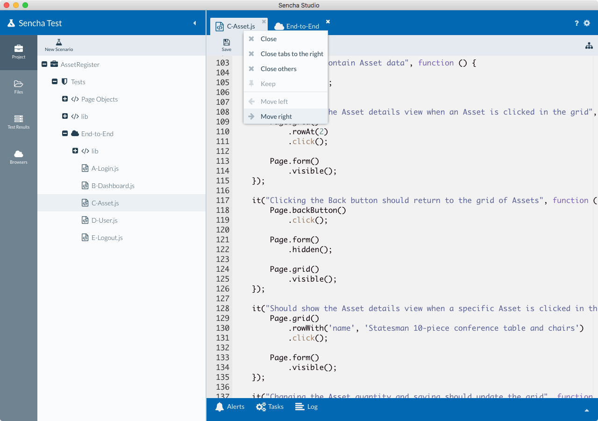
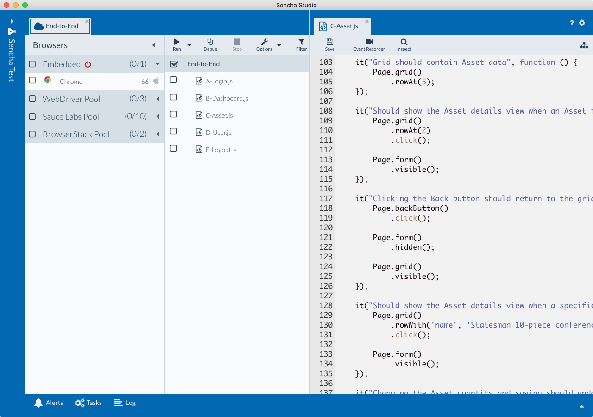

# Sencha Studio User Interface Tips

Sencha Studio provides the ability to create and configure your test projects, along with providing an editor
where you can directly write your tests (specs).

These tests can also be edited in an external code editor, as they are files that reside on the file system.

If you would prefer to stay within the Sencha Studio interface though, below are a couple of tips to optimize 
your user experience.

## Split screen

It's possible to have a split screen view, where you can have two views side-by-side.  This is useful when
you want to have both a test suite and scenario test runner screen visible, for the ability to quickly run 
tests without switching tabs.

By right-clicking on one of the tabs, you can use the "Move Right" menu option, which will split your 
screen between the test suite and scenario test runner screen:

You can also collapse the project tree, which gives you more screen space for the split view:

