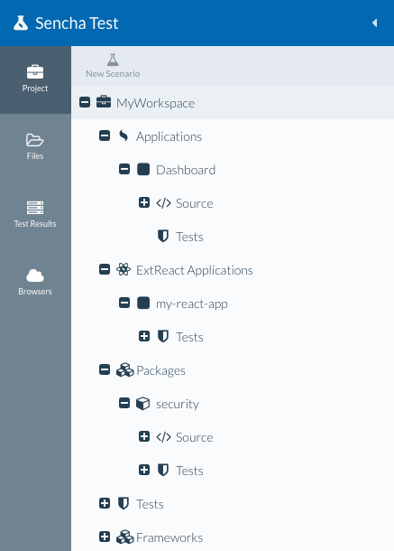
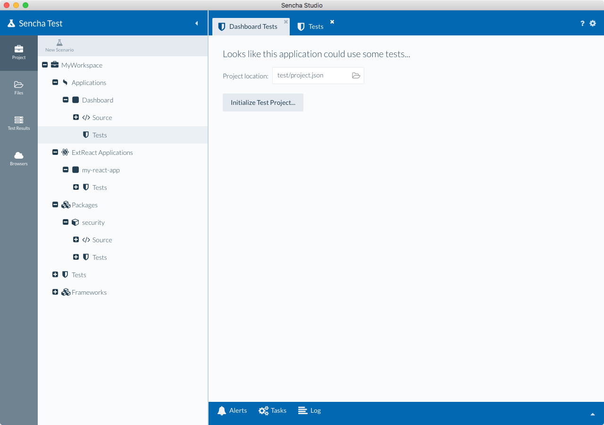
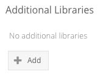
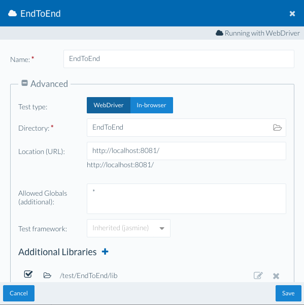
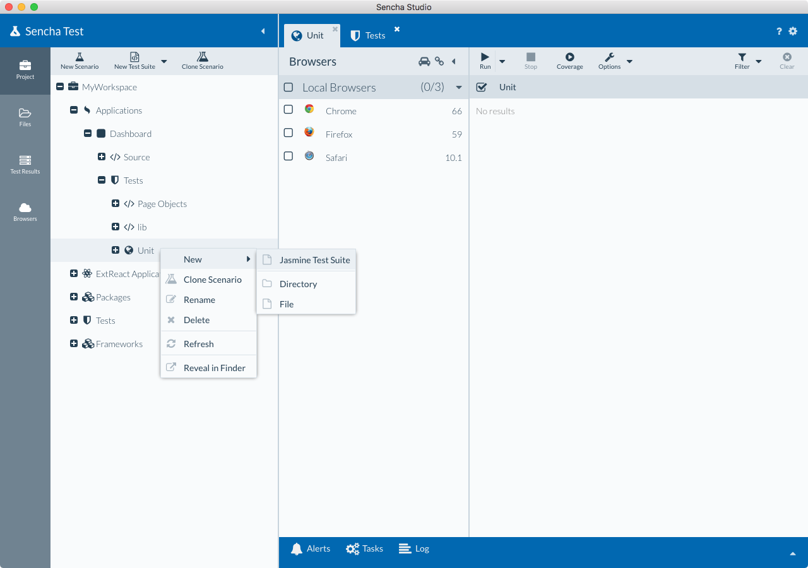
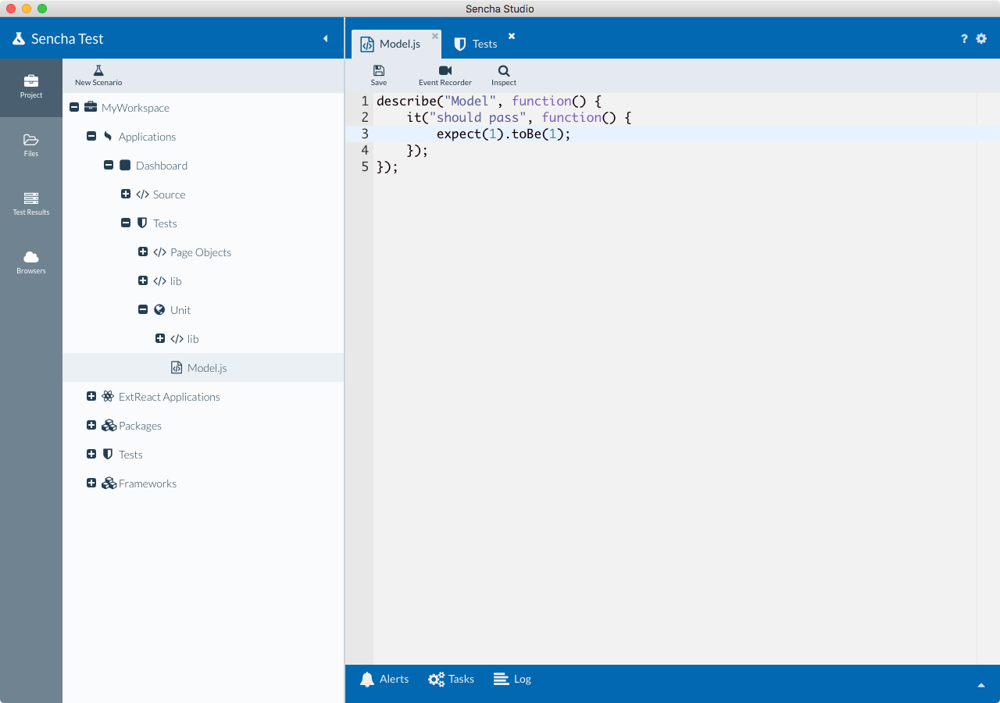

# Projects, Scenarios, and Suites

Sencha Studio enables you to author test scripts to repeatedly test your applications in a structured and predictable 
way.  This level of testing helps to ensure stability as your application grows and matures.  Before you create the 
individual tests, you will first need to 
[setup your workspace](./testing_extjs_apps.html) and initialize a **Test Project**.

Within each workspace/project, you will have a **Tests** node under the following groupings:

+ The workspace root itself
+ Each application in the workspace
+ Each package in the workspace

Test Projects are part of the test suite hierarchy in Sencha Studio.  They allow you to manage the scope of tests by way 
of a workspace.  Tests within the root workspace’s Test Project may be applied to code that is shared across any 
application or package within the workspace.  Tests in the Test Project of an application or package will be run 
against the code in their respective parents.

## Test Projects

### Initialize a Test Project
Once you are within a workspace, application, or package, you will see a “Tests” node under the parent folder.  When the 
Tests node is selected for the first time, Sencha Studio will display the Test Project creation screen.  Click 
“Initialize Test Project” to create the test project file (`test/project.json` by 
default, though you can specify another directory within the workspace if necessary).  Sencha 
Studio will create the Test Project and present the Test Project details view.

### Location (URL)
Test Projects located in the workspace root level or within a package will require you to enter the "index.html" target
file in the Project Settings "Location (URL)" field.  This target file is the one spun up at the time tests are run.  Projects
located within an application will use the application’s generated “index.html” file (unless explicitly overridden). The URL
provided should start with a valid protocol (http or https).

### Test Frameworks
Sencha Studio contains the latest version of Jasmine by default. Check out the excellent 
[Jasmine documentation](http://jasmine.github.io/2.4/introduction.html) for more information on authoring and editing 
Jasmine tests.

Documentation for writing adapters using other test frameworks will be detailed in a future guide as well.

### Additional Libraries
Additional JavaScript files may be included in the test runs in a Test Project by specifying the path for each file 
in the Additional Libraries section of the Test Project.  These files will often be external libraries such as mapping 
clients, data mocking utilities, and other supporting scripts that could be used when running tests.  The path of each 
file will append to the workspace directory; i.e. setting a file path of “shared/UserData.js” will result in the test 
runner loading “[workspaceDirectory]/shared/UserData.js” at test time.  All additional library files will be loaded 
prior to the running of the tests specs.

## Test Projects and Scenarios
A Test Project must contain at least one “Scenario” to be of any use.  Test Projects contain one or more Scenarios that 
serve to organize groupings of unit tests within a Test Project.  The Test Project contains common configuration items 
that will be inherited by all of its Scenarios.  Scenarios contain the information needed to define a complete collection 
of tests, including the location of test scripts, the URL of the test subject, etc.

### Adding a Scenario
You can add Scenarios by clicking the “New Scenario” button on the project toolbar.  Give the 
Scenario a name that describes what the tests will manage, and choose the scenario type.  If you have the Test Engineer persona 
selected, by default all added scenarios will be WebDriver scenarios. Developers have the option to choose between In-Browser and WebDriver.

The Scenario directory should be left as its default value unless you are avoiding a 
directory conflict in which case you may point to another directory within the Test 
Project's configured directory. 

After saving, the Scenario will appear in the workspace navigation tree under its parent Test Project.  

### Scenario Location (URL)
The Location (URL) field in the Scenario details allows you to:

1. Override the URL set in the parent Test Project’s details by supplying a URL (starting with “http” or “https”
1. Append a hash or query to the Test Project’s URL (by including a string starting with a “#”, “?”, or a some combination)

### Scenario Additional Libraries
Scenarios may have supporting JavaScript files specified in addition to those set in the Test Project.  Scenarios inherit 
the additional JavaScript libraries specified in the Test Project which are loaded before any additional libraries defined 
by the Scenario.

## Creating Jasmine Test Suites
You can create and edit tests directly in Sencha Studio or via your favorite IDE/text editor.  The tests will be located 
within the sub-folder indicated in the "Directory" field on the Scenario details view. You can navigate to said view by clicking on a Scenario in the Tests tab.  

To create a new test in Sencha Studio, use the context menu on the target Scenario in the 
Workspace navigation tree, or click the "New Test Suite" button on the top toolbar.

The test suites can then be opened for edit by expanding the parent Scenario node and 
selecting the test suite node.

Suites can be directly modified within Sencha Studio’s editor.  User-authored tests can be run against internal logic 
within an application or by simulating events on an application UI.  You can also use the Event Recorder functionality 
to author user interactions directly, which allows you to record live interactions within a browser.  These recorded 
events can then be repeated at test run time.

A suite follows the following convention:

    describe("A suite", function() {
    
    });

The first param in describe should be a plain English explanation of what the Suite aims to test.  Our actual tests will
go inside of the describe function.

## Creating Jasmine Test Specs

Once a suite has been added, the actual tests themselves can be created and added to the suite's describe function.  In 
Jasmine terms, an individual test is known as a spec.  A spec is a JavaScript function that explains what a portion of 
your program should accomplish.  Specs should explain in plain language what the test is aiming to prove.  It should then 
provide JavaScript that performs the tests for said expectation.

    it("contains spec with an expectation", function() {
        expect(true).toBe(true);
    });

So the suite and spec together appear as follows:

    describe("A suite", function() {
    
        it("contains spec with an expectation", function() {
            expect(true).toBe(true);
        });
    
    });

You can then add as many specs to your suite as you'd like.  It's ideal to keep your suites organized by what they aim
to test.  Often, this organization will follow your application's organization.

For more information about the Jasmine test framework, be sure to check out 
their [suite documentation](http://jasmine.github.io/2.4/introduction.html).

## Conclusion

Now that you have your test environment established you'll want to start authoring tests 
against your code.  For a complete example refer to the 
[Testing your Application with Sencha Studio](./testing_extjs_apps.html) walkthrough guide.  

If you have further questions, concerns, or bug reports, please visit the 
[Sencha Test forums](https://www.sencha.com/forum/forumdisplay.php?144-Sencha-Test)
