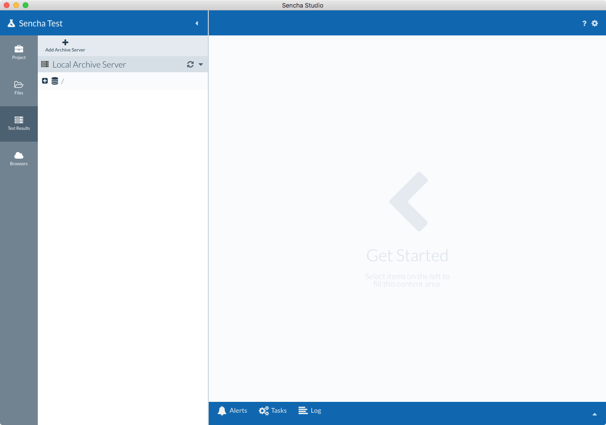
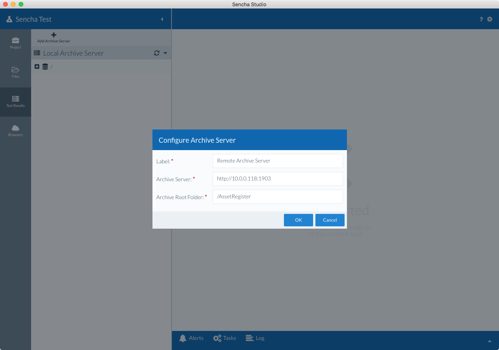
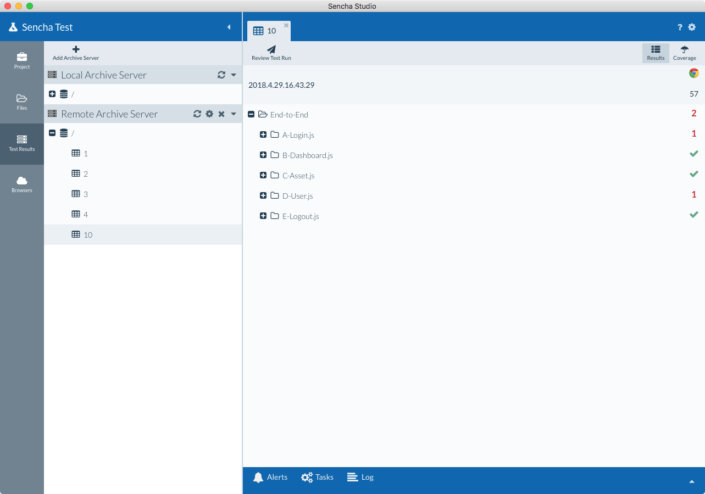
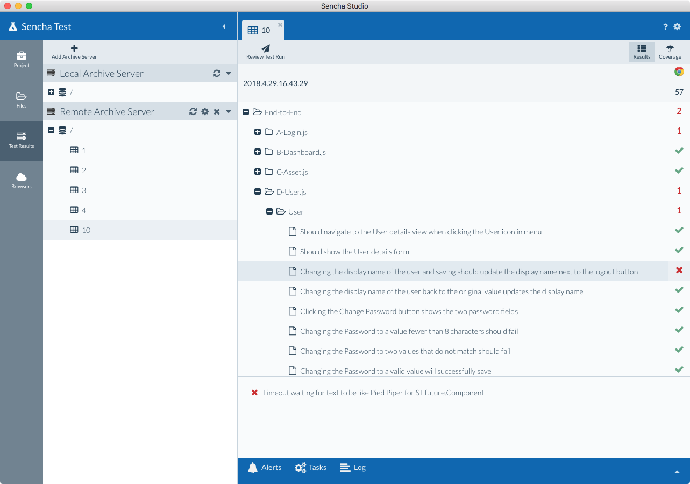

# Archive Server Results

In order to retrieve test run results in Sencha Studio from a remote or custom Archive Server instance, ensure 
you have an Archive Server instance running. See the [Archive Server guide](./sencha_test_archive_server.html) to 
learn how to configure an Archive Server.

## Connect to an Archive Server

1. With a project opened in Sencha Studio, navigate to the Test Results tab. By default, you will see a 
Local Archive Server in the list.

    

2. To connect to a remote or custom Archive Server instance, click the "Add Archive Server" button, and 
populate with the details of your instance:

    * **Label**: A display name for the Archive Server, for example `Remote Archive Server`
    * **Archive Server**: The URL to the Archive Server, including port number, for example `http://10.0.0.118:1903`
    * **Archive Root Folder**: The particular path within the Archive Server that you want to connect to (as defined
    in the server's `storage.json` file). Include a forward slash at the start of the path, for example 
    `/AssetRegister`.

    

3. After adding the Archive Server, you will be able to expand it and view the test run results. Selecting 
one of the runs will display a summary of the results:

    

4. Expanding the test suite and navigating to a spec/test that failed, and selecting it (by clicking on the
red "X") will show the failure details at the bottom of the test run results window:

    