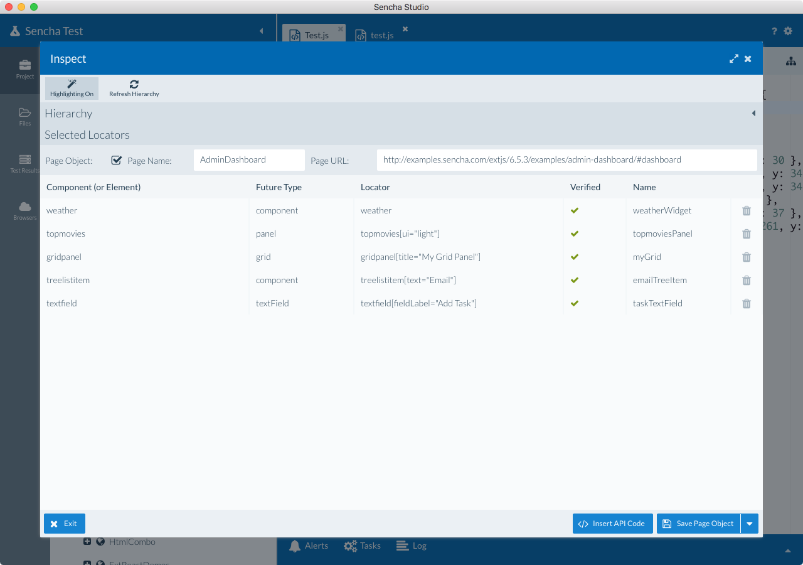

# Creating and Using Page Objects

Along with inspection of components and elements in a running web application, the Inspect tool enables users of Sencha Test to create Page Objects for accessing those components and elements across all of their tests.

## What are Page Objects?

[SeleniumHQ](https://www.seleniumhq.org/docs/06_test_design_considerations.jsp) defines it like this:
_The Page Object Design Pattern provides the following advantages_

1. _There is a clean separation between test code and page specific code such as 
locators (or their use if you’re using a UI Map) and layout._

2. _There is a single repository for the services or operations offered by the page 
rather than having these services scattered throughout the tests._

The idea is very simple. You create functions or objects of all the components on a 
page in the application under test. You reuse them in multiple tests by instantiating 
the objects when needed. This means you can avoid having to copy and paste a locator across  
multiple test cases, which minimizes the need to modify the locator value when the 
developer changes the label from Subject to something else (for example).

## Inspect Tool for Page Objects

To create a Page Object, follow these steps:

1. Launch the Inspect tool by placing your cursor inside of an `it` block within a test suite, and clicking the Inspect button

2. On arriving at the Inspect Grid and Selected Locators, select the Page Object 
checkbox, and enter a page name for this page. 

3. You may confirm that the URL is correct but may not change the URL. In order to change the URL you must change the URL in the Scenario or add some 
code to your test which navigates to the desired URL.

5. Add components or elements by clicking in the browser or by adding from the Hierarchy view.

6. Refine the locator string by selecting one of the pre-populated strings from the 
drop-down, by opening the Wizard or by typing in one manually (not recommended).

7. Give the component/element locator a name.

8. Save the page object. You also have the option to Save and Insert, which will insert the Page Object code  to reference the components/elements.

    

## Using Page Objects

After a Page Object has been created, you are able to make use of a Page Object within test suites using this syntax: `stpo.<page name>.<locator name>`, for example, with a Page Object named `AdminDashboard`, and a text field locator named `taskTextField`, you can reference that component/element using this code:

    stpo.AdminDashboard.taskTextField();

Then, you can tag on any of the Future APIs. For example, if you wanted to check the component or element was visible, you could use the `visible` API:

    stpo.AdminDashboard
        .taskTextField()
        .visible();

Or, you may want to focus the field, type some text, then assert the value matches what was entered:

    stpo.AdminDashboard
        .taskTextField()
        .focus()
        .type('wash car')
        .value('wash car');